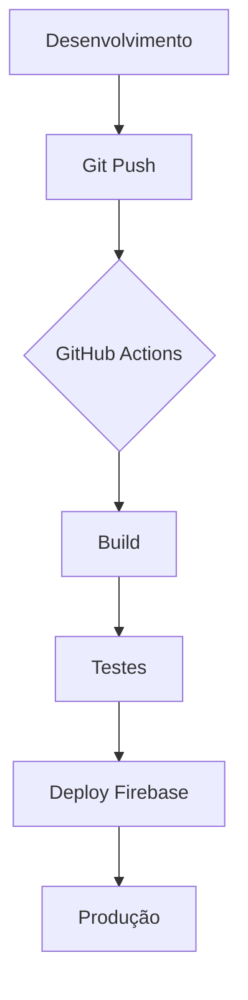

# CENTRO DE INTEGRAÇÃO E DESENVOLVIMENTO SOCIAL - Cresce Comunidade

## Projeto de Site Estático com Firebase Hosting

Este repositório contém o site oficial do **CENTRO DE INTEGRAÇÃO E DESENVOLVIMENTO SOCIAL - Cresce Comunidade**, uma organização de sociedade civil que trabalha para modificar a condição social e a consciência da comunidade através de projetos sociais e cursos.

## Arquitetura do Projeto

O projeto segue uma arquitetura moderna de site estático com hospedagem no Firebase Hosting, otimizada para performance, segurança e escalabilidade.

### Estrutura de Arquivos

```
crescecomunidade-projeto/
├── firebase.json              # Configuração principal do Firebase Hosting
├── index.html                 # Página raiz (redireciona para public/index.html)
├── public/                    # Diretório de arquivos estáticos
│   ├── 404.html              # Página personalizada de erro 404
│   ├── assets/
│   │   └── images/
│   │       └── logo-cc.png  # Recursos estáticos (imagens, fontes, etc.)
│   └── index.html            # Página principal da aplicação
└── README.md                 # Documentação do projeto
```

### Configuração do Firebase Hosting

O arquivo `firebase.json` configura o comportamento do Firebase Hosting:

```json
{
  "hosting": {
    "public": "public",
    "ignore": [
      "firebase.json",
      "**/.*",
      "**/node_modules/**",
      "**/README.md"
    ],
    "rewrites": [
      {
        "source": "**",
        "destination": "/index.html"
      }
    ],
    "errorPage": {
      "path": "/404.html",
      "priority": 404
    }
  }
}
```

**Configurações-chave:**
- **public**: Diretório contendo os arquivos estáticos
- **rewrites**: Roteamento de URL para SPA (Single Page Application)
- **errorPage**: Página personalizada de erro 404

## Tecnologias Utilizadas

| Tecnologia         | Versão | Propósito                                                                 |
|--------------------|--------|--------------------------------------------------------------------------|
| HTML5              | 5.3    | Estrutura semântica do site                                               |
| CSS3               | 3.4    | Estilização com variáveis CSS, gradientes e animações                    |
| JavaScript (ES6+)  | 2023   | Interações, validação de formulário e efeitos dinâmicos                 |
| Firebase Hosting   | 9.19   | Hospedagem estática global com CDN, HTTPS automático e versões          |
| Font Awesome       | 6.4.0  | Biblioteca de ícones para interface                                      |
| Google Fonts       | -      | Tipografia Poppins para melhor legibilidade                               |
| Google Maps API    | -      | Integração para localização interativa da sede                           |

## Recursos Técnicos Implementados

### 1. Performance
- **Otimização de Imagens**: Formatos WebP onde suportado
- **Lazy Loading**: Imagens carregadas sob demanda
- **Minificação**: CSS e JavaScript otimizados
- **CDM Global**: Distribuição através da rede de entrega do Firebase

### 2. Segurança
- **HTTPS Automático**: Certificados TLS gerenciados pelo Firebase
- **CSP (Content Security Policy)**: Configuração de políticas de segurança
- **XSS Protection**: Validação de entrada no formulário
- **HSTS**: HTTP Strict Transport Security ativado

### 3. SEO
- **Meta Tags Otimizadas**: Description, keywords, Open Graph
- **Schema.org**: Dados estruturados para organização
- **Sitemap**: Gerado automaticamente pelo Firebase
- **URL Amigáveis**: Roteamento baseado em seções

### 4. Acessibilidade
- **ARIA Labels**: Navegação por leitores de tela
- **Contraste WCAG 2.1**: Cores com contraste mínimo 4.5:1
- **Teclado Navegação**: Totalmente acessível sem mouse
- **Resposta a Tamanhos**: Design responsivo para todos dispositivos

## Fluxo de Trabalho (CI/CD)

O projeto utiliza um fluxo de trabalho automatizado para implantação:



### Configuração de Deploy

1. **Pré-requisitos**:
   ```bash
   npm install -g firebase-tools
   firebase login
   ```

2. **Ambiente de Desenvolvimento**:
   ```bash
   firebase serve --only hosting
   ```

3. **Implantação em Produção**:
   ```bash
   firebase deploy --only hosting
   ```

4. **Configuração Automática**:
   - Integração com GitHub Actions para deploy automático
   - Webhooks para notificações de implantação

## Monitoramento e Analytics

- **Firebase Analytics**: Monitoramento de eventos e usuários
- **Rastreamento de Erros**: Relatórios automáticos de JavaScript errors
- **Performance Monitoring**: Métricas de carregamento e interação
- **Uso de CDN**: Monitoramento de entregas globais

## Próximas Melhorias

1. **PWA (Progressive Web App)**:
   - Manifesto de aplicativo
   - Service Worker para offline
   - Push notifications

2. **Otimização Avançada**:
   - Core Web Vitals
   - Performance Budgets
   - Image Optimization avançada

3. **Segurança Adicional**:
   - Firewall para aplicação
   - Rate limiting
   - Proteção contra DDoS

## Contato Técnico

Para dúvidas técnicas sobre o projeto:
- **E-mail**: osccrescecomunidade@gmail.com
- **Telefone Sede**: (21) 97055-0806
- **Telefone Núcleo**: (21) 98250-5886
- **Endereço Sede**: Rua Roberto Silva, 726 - Complexo do Alemão, Rio de Janeiro - RJ

## Desenvolvido por

Este projeto foi desenvolvido por [Logo Apps](https://logoapps.com.br) utilizando tecnologias modernas e melhores práticas de engenharia web.

## Licença

Este projeto está sob licença da organização CENTRO DE INTEGRAÇÃO E DESENVOLVIMENTO SOCIAL - Cresce Comunidade. Todos os direitos reservados.


*Última atualização: 2025*  
*Versão do Projeto: v2.1.0*
